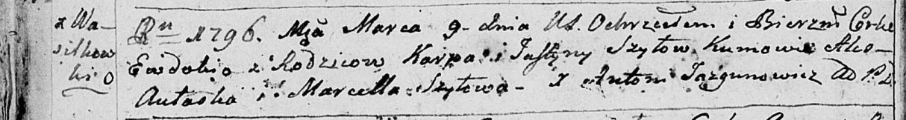

**Шило Евдокия Карпова (Szyłowna Ewdokija)**

9 марта 1796 г -- крещение (НИАБ 136-13-894, лист 28об, №28/1796-р
(ориг)).

Лист 28-об. **Метрическая запись №28/1796-р (ориг).**

Дедиловичская Покровская церковь. 9 марта 1796 года. Метрическая запись
о крещении.

Szyłowna Ewdokija -- дочь родителей с деревни Васильковка.

Szyło Karp -- отец.

Szyłowa Justyna -- мать.

Aułaska Aleś - кум.

Szyłowa Marcella - кума.

Jazgunowicz Antoni -- ксёндз.
