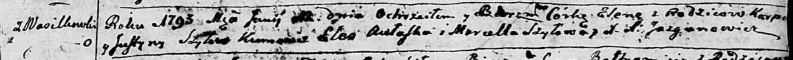

**Шило Карп (Szyło Karp, Karpiey)**

30 сентября 1789 г -- крещение дочери Евы (НИАБ 136-13-894, лист 7об,
№50/1789-р (ориг)), (РГИА 823-2-18, лист 238об, №23/1789-р (коп)).

12 июня 1793 г -- крещение дочери Елены (НИАБ 136-13-894, лист 20,
№49/1793-р (ориг)).

9 марта 1796 г -- крещение дочери Евдокии (НИАБ 136-13-894, лист 28об,
№28/1796-р (ориг)).

27 января 1799 г -- крещение дочери Агнеты (НИАБ 1781-27-199, лист 125,
№11/1799-р).

17 сентября 1802 г -- крещение дочери Розалии (НИАБ 937-4-32, лист 7об,
№30/1802-р).

14 июня 1806 г -- крещение сына Антона (НИАБ 937-4-32, лист 13об,
№12/1806-р).

Лист 7об. **Метрическая запись №50/1789-р (ориг).**

{width="6.496527777777778in"
height="0.6725174978127734in"}

Дедиловичская Покровская церковь. 30 сентября 1789 года. Метрическая
запись о крещении.

Szyłowna Ewa -- дочь родителей с деревни Васильковка.

Szyło \[Karp\] -- отец.

Szyłowa Justyna -- мать.

Pietkiewicz Jan, JP -- кум, шляхтич.

Strzyzowska \[Elena\], JP -- кума, шляхтянка.

Jazgunowicz Antoni -- ксёндз.

**РГИА 823-2-18:** Лист 238об. **Метрическая запись №23/1789-р (коп).**

{width="6.496527777777778in"
height="1.19375in"}

Дедиловичская Покровская церковь. 30 сентября 1789 года. Метрическая
запись о крещении.

Szyłowna Ewa -- дочь родителей с деревни Васильковка.

Szyło Karp -- отец.

Szyłowa Justyna -- мать.

Pietkiewicz Jan -- кум.

Stryżewska Elena - кума.

Jazgunowicz Antoni -- ксёндз.

**НИАБ 136-13-894:** Лист 20. **Метрическая запись №49/1793-р (ориг).**

{width="6.496527777777778in"
height="0.4961745406824147in"}

Дедиловичская Покровская церковь. 12 июня 1793 года. Метрическая запись
о крещении.

Szyłowna Elena -- дочь родителей с деревни Васильковка.

Szyło Karp -- отец.

Szyłowa Justyna -- мать.

Aułaska Eleś - кум.

Szyłowa Marcella - кума.

Jazgunowicz Antoni -- ксёндз.

**НИАБ 136-13-894:** Лист 28-об. **Метрическая запись №28/1796-р
(ориг).**

{width="6.496527777777778in"
height="0.8669641294838145in"}

Дедиловичская Покровская церковь. 9 марта 1796 года. Метрическая запись
о крещении.

Szyłowna Ewdokija -- дочь родителей с деревни Васильковка.

Szyło Karp -- отец.

Szyłowa Justyna -- мать.

Aułaska Aleś - кум.

Szyłowa Marcella - кума.

Jazgunowicz Antoni -- ксёндз.

**НИАБ 1781-27-199:** Лист 125. **Метрическая запись №11/1799-р.**

{width="6.496527777777778in"
height="0.45in"}

Дедиловичский костел Наисвятейшего Сердца Иисуса. 27 января 1799 года.
Метрическая запись о крещении.

Szyłowna Agneta -- дочь крестьян с деревни Васильковка.

Szyło Karpiey -- отец.

Szyłowa Justina -- мать.

Aułasko Alexander -- крестный отец.

Szyłowa Marcella - крестная мать.

Linhart Hyacinthus -- ксёндз.

**НИАБ 937-4-32:** Лист 7об. **Метрическая запись №30/1802-р.**

{width="6.496527777777778in"
height="0.9347222222222222in"}

Дедиловичский костел Наисвятейшего Сердца Иисуса. 17 сентября 1802 года.
Метрическая запись о крещении.

Szyłowna Rosalia -- дочь крестьян с деревни Васильковка.

Szyło Carpiey -- отец.

Szyłowa Justina -- мать.

Aułasko Alexander -- крестный отец, крестьянин.

Szyłowa Marcella -- крестная мать, крестьянка.

Linhart Hyacinthus -- ксёндз.

**НИАБ 937-4-32:** Лист 13об. **Метрическая запись №12/1806-р.**

{width="6.496527777777778in"
height="1.229861111111111in"}

Дедиловичский костел Наисвятейшего Сердца Иисуса. 14 июня 1806 года.
Метрическая запись о крещении.

Szyło Antoni -- сын родителей с деревни Васильковка.

Szyło Carp -- отец.

Szyłowa Justina -- мать.

Aułasko Alexander -- крестный отец, с деревни Веретей.

Szyłowa Marcella -- крестная мать, с деревни Лустичи.

Kłoczko Antonius -- ксёндз, администратор Омнишевского костела.
