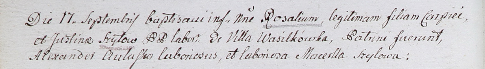

**Шило Розалия Карпова (Szyłowna Rosalia)**

17 сентября 1802 г -- крещение (НИАБ 937-4-32, лист 7об, №30/1802-р).

**НИАБ 937-4-32:** Лист 7об. **Метрическая запись №30/1802-р.**

Дедиловичский костел Наисвятейшего Сердца Иисуса. 17 сентября 1802 года.
Метрическая запись о крещении.

Szyłowna Rosalia -- дочь крестьян с деревни Васильковка.

Szyło Carpiey -- отец.

Szyłowa Justina -- мать.

Aułasko Alexander -- крестный отец, крестьянин.

Szyłowa Marcella -- крестная мать, крестьянка.

Linhart Hyacinthus -- ксёндз.
