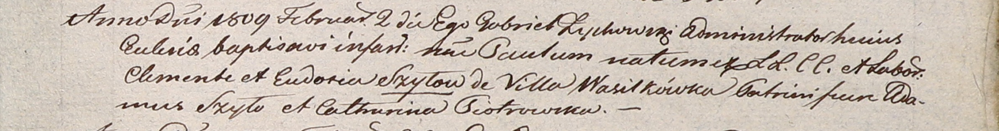

**Шило Клеменс, Клементий (Szyło Klemąs, Klementi)**

10 июля 1804 г -- крещение сына Филиппа (НИАБ 937-4-32, лист 10об,
№19/1804-р).

14 марта 1806 г -- крещение сына Казимира (НИАБ 937-4-32, лист 13,
№8/1806-р).

2 февраля 1809 г -- крещение сына Павла (НИАБ 937-4-32, лист 19,
№3/1809-р).

10 октября 1811 г -- крещение дочери Полонии (НИАБ 136-13-894, лист 82,
№50/1811-р (ориг)).

**НИАБ 937-4-32:** Лист 10об. **Метрическая запись №19/1804-р.**

{width="6.496527777777778in"
height="0.6798611111111111in"}

Дедиловичский костел Наисвятейшего Сердца Иисуса. 10 июля 1804 года.
Метрическая запись о крещении.

Szyło Philipp -- сын крестьян с деревни Васильковка.

Szyło Clementis -- отец.

Szyłowa Audocia -- мать.

Karzewicz Philipp -- крестный отец.

Szydłowska Anastasia -- крестная мать.

Galinowski Joann -- ксёндз, комендант Дедиловичского костела.

**НИАБ 937-4-32:** Лист 13. **Метрическая запись №8/1806-р.**

{width="6.496527777777778in"
height="1.2902777777777779in"}

Дедиловичский костел Наисвятейшего Сердца Иисуса. 14 марта 1806 года.
Метрическая запись о крещении.

Szyło Casimir -- сын родителей с деревни Васильковка.

Szyło Clementi -- отец.

Szyłowa Audocia -- мать.

Kułakowski Cornelius -- крестный отец, с деревни Васильковка.

Szyłowa Christina -- крестная мать, с деревни Веретей.

Linhart Hiacinthus -- ксёндз.

**НИАБ 937-4-32:** Лист 19. **Метрическая запись №3/1809-р.**

{width="6.496527777777778in"
height="0.8520833333333333in"}

Дедиловичский костел Наисвятейшего Сердца Иисуса. 2 февраля 1809 года.
Метрическая запись о крещении.

Szyło Paul -- сын крестьян с деревни Васильковка.

Szyło Clemente -- отец.

Szyłowa Eudokia -- мать.

Szyło Adam -- крестный отец.

Piotrowska Catharina -- крестная мать.

Zychowski Gabriel -- ксёндз.

**НИАБ 136-13-894:** Лист 82. **Метрическая запись №50/1811-р (ориг).**

{width="6.496527777777778in"
height="0.897807305336833in"}

Осовская Покровская церковь. 10 октября 1811 года. Метрическая запись о
крещении.

Szyłowna Połonia -- дочь родителей с деревни Васильковка.

Szyło Klemęs -- отец.

Szyłowna Eudokija -- мать.

Szyło Adam -- кум.

Szyłakowa Nastazya -- кума.

Woyniewicz Tomasz -- ксёндз.
