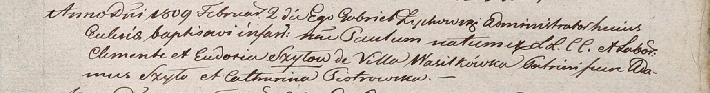

**Шило Павел Клеменсов (Szyło Paul)**

2 февраля 1809 г -- крещение (НИАБ 937-4-32, лист 19, №3/1809-р).

**НИАБ 937-4-32:** Лист 19. **Метрическая запись №3/1809-р.**

{width="6.496527777777778in"
height="0.8520833333333333in"}

Дедиловичский костел Наисвятейшего Сердца Иисуса. 2 февраля 1809 года.
Метрическая запись о крещении.

Szyło Paul -- сын крестьян с деревни Васильковка.

Szyło Clemente -- отец.

Szyłowa Eudokia -- мать.

Szyło Adam -- крестный отец.

Piotrowska Catharina -- крестная мать.

Zychowski Gabriel -- ксёндз.
