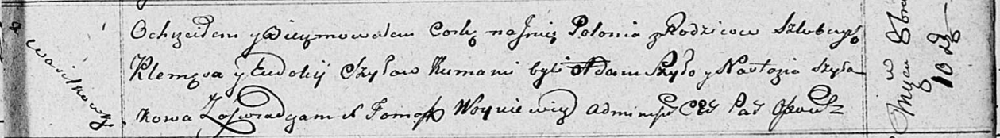

**Шило Полония Клеменсова (Szyłowna Połonia)**

10 октября 1811 г -- крещение (НИАБ 136-13-894, лист 82, №50/1811-р
(ориг)).

**НИАБ 136-13-894:** Лист 82. **Метрическая запись №50/1811-р (ориг).**

{width="6.496527777777778in"
height="0.897807305336833in"}

Осовская Покровская церковь. 10 октября 1811 года. Метрическая запись о
крещении.

Szyłowna Połonia -- дочь родителей с деревни Васильковка.

Szyło Klemęs -- отец.

Szyłowna Eudokija -- мать.

Szyło Adam -- кум.

Szyłakowa Nastazya -- кума.

Woyniewicz Tomasz -- ксёндз.
