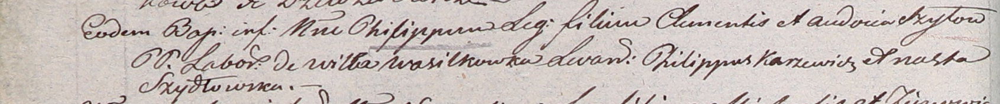

**Шило Филипп Клеменсов (Szyło Philipp)**

10 июля 1804 г -- крещение (НИАБ 937-4-32, лист 10об, №19/1804-р).

**НИАБ 937-4-32:** Лист 10об. **Метрическая запись №19/1804-р.**

{width="6.496527777777778in"
height="0.6798611111111111in"}

Дедиловичский костел Наисвятейшего Сердца Иисуса. 10 июля 1804 года.
Метрическая запись о крещении.

Szyło Philipp -- сын крестьян с деревни Васильковка.

Szyło Clementis -- отец.

Szyłowa Audocia -- мать.

Karzewicz Philipp -- крестный отец.

Szydłowska Anastasia -- крестная мать.

Galinowski Joann -- ксёндз, комендант Дедиловичского костела.
