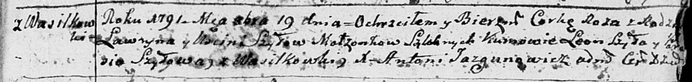
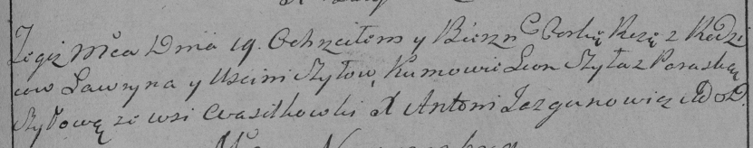

**Шило Роза Лаврынова (Szyłowna Roza)**

19 декабря 1791 г -- крещение (НИАБ 136-13-894, лист 14, №49/1791-р
(ориг)), (РГИА 823-2-18, лист 242, №27/1791-р (коп)).

**НИАБ 136-13-894:** Лист 14. **Метрическая запись №49/1791-р (ориг).**

Дедиловичская Покровская церковь. 19 октября 1791 года. Метрическая
запись о крещении.

Szyłowna Roza -- дочь родителей с деревни Васильковка.

Szyło Ławryn -- отец.

Szyłowa Uscinia -- мать.

Szyło Leon - кум.

Szyłowa Parasia - кума.

Jazgunowicz Antoni -- ксёндз.

**РГИА 823-2-18:** Лист 243. **Метрическая запись №27/1791-р (коп).**

Дедиловичская Покровская церковь. 19 октября 1791 года. Метрическая
запись о крещении.

Szyłowna Roza -- дочь родителей с деревни Васильковка.

Szyło Ławryn -- отец.

Szyłowa Justinia -- мать.

Szyło Leon -- кум.

Szyłowa Paraska - кума.

Jazgunowicz Antoni -- ксёндз.
