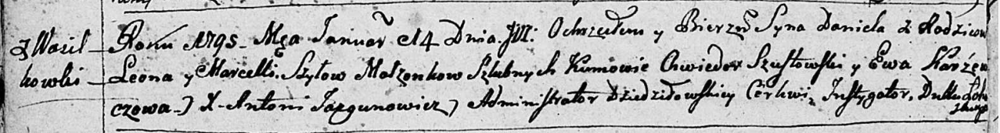
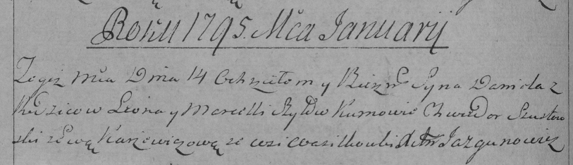

**Шило Даниил Леонов (Szyło Daniel)**

14 января 1795 г -- крещение (НИАБ 136-13-894, лист 23об, №1/1795-р
(ориг)), (РГИА 823-2-18, лист 251об, №1/1795-р (коп)).

**НИАБ 136-13-894:** Лист 23об. **Метрическая запись №1/1795-р (ориг).**

Дедиловичская Покровская церковь. 14 января 1795 года. Метрическая
запись о крещении.

Szyło Daniel -- сын родителей с деревни Васильковка.

Szyło Leon -- отец.

Szyłowa Marcella -- мать.

Szustowski Chwiedor - кум.

Karżewiczowa Ewa - кума.

Jazgunowicz Antoni -- ксёндз.

**РГИА 823-2-18:** Лист 251об. **Метрическая запись №1/1795-р (коп).**

Дедиловичская Покровская церковь. 14 января 1795 года. Метрическая
запись о крещении.

Szyło Daniel -- сын родителей с деревни Васильковка.

Szyło Leon -- отец.

Szyłowa Marcella -- мать.

Szustowski Chwiedor -- кум.

Karżewiczowa Ewa -- кума.

Jazgunowicz Antoni -- ксёндз.
