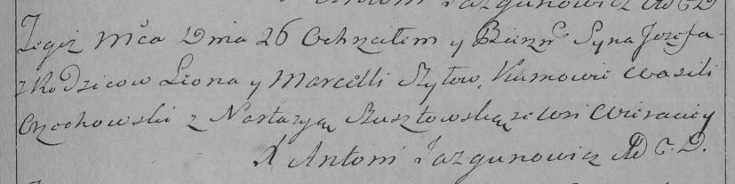

**Шило Иосиф Леонов (Szyło Jozef)**

26 декабря 1792 г -- крещение (НИАБ 136-13-894, лист 18, №86/1792-р
(ориг)), (РГИА 823-2-18, лист 246, №39/1792-р (коп)).

**НИАБ 136-13-894:** Лист 18. **Метрическая запись №86/1792-р (ориг).**

{width="6.496527777777778in"
height="0.7348742344706911in"}

Дедиловичская Покровская церковь. 26 декабря 1792 года. Метрическая
запись о крещении.

Szyło Jozef -- сын родителей с деревни Васильковка.

Szyło Leon -- отец.

Szyłowa Marcella -- мать.

Orzechowski Wasil - кум.

Szustowska Nastazyia - кума.

Jazgunowicz Antoni -- ксёндз.

**РГИА 823-2-18:** Лист 246. **Метрическая запись №39/1792-р (коп).**

{width="6.496527777777778in"
height="1.6263888888888889in"}

Дедиловичская Покровская церковь. 26 декабря 1792 года. Метрическая
запись о крещении.

Szyło Jozef -- сын родителей с деревни \[Васильковка\].

Szyło Leon -- отец.

Szyłowa Marcella -- мать.

Orzechowski Wasili -- кум.

Szustowska Nastazya -- кума.

Jazgunowicz Antoni -- ксёндз.
