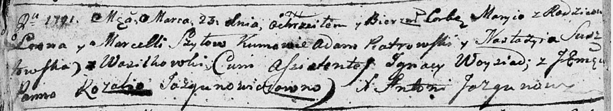

**Шило Мария Леонова (Szyłowna Maryja)**

23 марта 1791 г -- крещение (НИАБ 136-13-894, лист 12об, №10/1791-р
(ориг)).

**НИАБ 136-13-894:** Лист 12об. **Метрическая запись №10/1791-р
(ориг).**

Дедиловичская Покровская церковь. 23 марта 1791 года. Метрическая запись
о крещении.

Szyłowna Maryja -- дочь родителей с деревни Васильковка.

Szyło Leon -- отец.

Szyłowa Marcella -- мать.

Piatrowski Adam - кум.

Susztowska Nastazyia -- кума.

Woysiad Jgnacy -- ассистент.

Jazgunowiczowna Rozalia, JP -- ассистентка, шляхтянка.

Jazgunowicz Antoni -- ксёндз.
