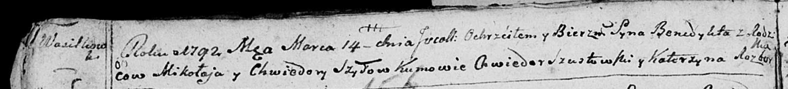

**Шило Бенедыкт Миколаев (Szyło Benedykt)**

14 марта 1792 г -- крещение (НИАБ 136-13-894, лист 15об, №14/1792-р
(ориг)).

**НИАБ 136-13-894:** Лист 15об. **Метрическая запись №14/1792-р
(ориг).**

Дедиловичская Покровская церковь. 14 марта 1792 года. Метрическая запись
о крещении.

Szyło Benedykt -- сын родителей с деревни Васильковка.

Szyło Mikołay -- отец.

Szyłowa Chwiedora -- мать.

Szustowski Chwiedor - кум.

Rozborska Katerzyna - кума.
