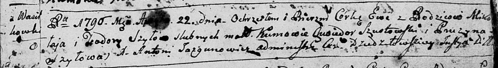

**Шило Ева Миколаева (Szyłowna Ewa)**

22 апреля 1796 г -- крещение (НИАБ 136-13-894, лист 29, №50/1796-р
(ориг)).

Лист 29. **Метрическая запись №50/1796-р (ориг).**

{width="6.496527777777778in"
height="0.8917727471566054in"}

Дедиловичская Покровская церковь. 22 апреля 1796 года. Метрическая
запись о крещении.

Szyłowna Ewa -- дочь родителей с деревни Васильковка.

Szyło Mikołay -- отец.

Szyłowa Teodora -- мать.

Szustowski Chwiedor - кум.

Szyłowa Pruzyna - кума.

Jazgunowicz Antoni -- ксёндз.
