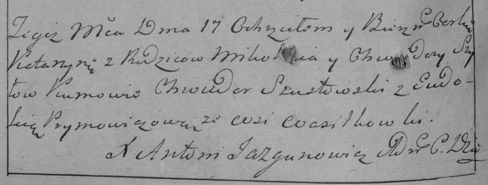

**Шило Кацярына Миколаева (Szyłowna Katarzyna)**

17 ноября 1784 г -- крещение дочери Кацярыны (РГИА 829-2-18, лист 227об,
№25/1784-р (коп)).

**РГИА 823-2-18:** Лист 227об. **Метрическая запись №25/1784-р (коп).**

{width="6.496527777777778in"
height="2.4722222222222223in"}

Дедиловичская Покровская церковь. 17 ноября 1784 года. Метрическая
запись о крещении.

Szyłowna Katarzyna -- дочь родителей с деревни Васильковка.

Szyło Mikołay -- отец.

Szyłowa Chwiedora -- мать.

Szustowski Chwiedor -- кум.

Prymowiczowa Eudokija - кума.

Jazgunowicz Antoni -- ксёндз.
