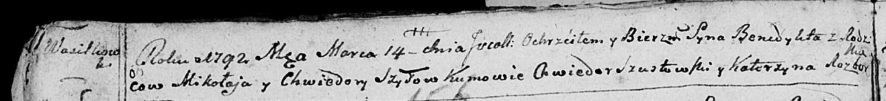

**Шило Хведора (Szyłowa Chwiedora)**

17 ноября 1784 г -- крещение дочери Кацярыны (РГИА 829-2-18, лист 227об,
№25/1784-р (коп)).

27 мая 1789 г -- крещение сына Яна (НИАБ 136-13-894, лист 7, №29/1789-р
(ориг)).

14 марта 1792 г -- крещение сына Бенедыкта (НИАБ 136-13-894, лист 15об,
№14/1792-р (ориг)).

22 апреля 1796 г -- крещение дочери Евы (НИАБ 136-13-894, лист 29,
№50/1796-р (ориг)).

3 марта 1801 г -- возможно, крестная мать у Анны Марты, дочери
Шапелевичей Хведора и Агафии с деревни Домашковичи (НИАБ 136-13-894,
лист 43, №8/1801-р (ориг)).

7 апреля 1807 г -- возможно, крестная мать Грыгора Игната, сына Церахов
Харытона и Катерыны с деревни Лустичи (НИАБ 136-13-894, лист 62об,
№21/1807-р (ориг)).

**РГИА 823-2-18:** Лист 227об. **Метрическая запись №25/1784-р (коп).**

Дедиловичская Покровская церковь. 17 ноября 1784 года. Метрическая
запись о крещении.

Szyłowna Katarzyna -- дочь родителей с деревни Васильковка.

Szyło Mikołay -- отец.

Szyłowa Chwiedora -- мать.

Szustowski Chwiedor -- кум.

Prymowiczowa Eudokija - кума.

Jazgunowicz Antoni -- ксёндз.

**НИАБ 136-13-894:** Лист 7. **Метрическая запись №29/1789-р (ориг).**

Дедиловичская Покровская церковь. 27 мая 1789 года. Метрическая запись о
крещении.

Szyło Jan -- сын родителей с деревни Васильковка.

Szyło Mikołay -- отец.

Szyłowa Chwiedora -- мать.

Szusztowski Chwiedor - кум.

Bielawska Katerzyna - кума.

Jazgunowicz Antoni -- ксёндз.

**НИАБ 136-13-894:** Лист 15об. **Метрическая запись №14/1792-р
(ориг).**

Дедиловичская Покровская церковь. 14 марта 1792 года. Метрическая запись
о крещении.

Szyło Benedykt -- сын родителей с деревни Васильковка.

Szyło Mikołay -- отец.

Szyłowa Chwiedora -- мать.

Szustowski Chwiedor - кум.

Rozborska Katerzyna - кума.

Лист 29. **Метрическая запись №50/1796-р (ориг).**

Дедиловичская Покровская церковь. 22 апреля 1796 года. Метрическая
запись о крещении.

Szyłowna Ewa -- дочь родителей с деревни Васильковка.

Szyło Mikołay -- отец.

Szyłowa Teodora -- мать.

Szustowski Chwiedor - кум.

Szyłowa Pruzyna - кума.

Jazgunowicz Antoni -- ксёндз.

**НИАБ 136-13-894:** Лист 43. **Метрическая запись №8/1801-р (ориг).**

Дедиловичская Покровская церковь. 3 марта 1801 года. Метрическая запись
о крещении.

Szapialewiczowa Anna Marta -- дочь родителей с деревни Домашковичи.

Szapialewicz Chwiedor -- отец.

Szapialewiczowa Ahapa -- мать.

Kurnesz Chwiedor -- кум, с деревни Лустичи.

Szyłowa Chwiedora -- кума, с деревни Васильковка.

Jazgunowicz Antoni -- ксёндз.

**НИАБ 136-13-894:** Лист 62об. **Метрическая запись №21/1807-р
(ориг).**

Дедиловичская Покровская церковь. 7 апреля 1807 года. Метрическая запись
о крещении.

Cierach Hryhor Jhnat -- сын родителей с деревни Лустичи.

Cierach Charyton -- отец.

Cierachowa Katerzyna -- мать.

Szustowski Chwiedor -- кум, с застенока Васильковка.

Szyłowa Chwiedora -- кума, с деревни Васильковка.

Jazgunowicz Antoni -- ксёндз.
