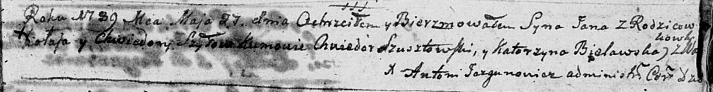

**Шило Ян Миколаев (Szyło Jan)**

27 мая 1789 г -- крещение (НИАБ 136-13-894, лист 7, №29/1789-р (ориг)).

**НИАБ 136-13-894:** Лист 7. **Метрическая запись №29/1789-р (ориг).**

Дедиловичская Покровская церковь. 27 мая 1789 года. Метрическая запись о
крещении.

Szyło Jan -- сын родителей с деревни Васильковка.

Szyło Mikołay -- отец.

Szyłowa Chwiedora -- мать.

Szusztowski Chwiedor - кум.

Bielawska Katerzyna - кума.

Jazgunowicz Antoni -- ксёндз.
