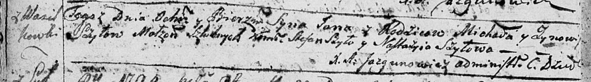

**Шило Барбара Михасёва (Szyłowna Barbara)**

23 октября 1799 г -- крещение (НИАБ 1781-27-199, лист 129, №47/1799-р).

**НИАБ 1781-27-199:** Лист 129. **Метрическая запись №47/1799-р.**

{width="6.496527777777778in"
height="0.49722222222222223in"}

Дедиловичский костел Наисвятейшего Сердца Иисуса. 23 октября 1799 года.
Метрическая запись о крещении.

Szyłowna Barbara -- дочь крестьян с деревни Васильковка.

Szyło Michaelis -- отец.

Szyłowa Zenovia -- мать.

Szyło Stephanus -- крестный отец.

Szyłowa Nasta -- крестная мать.

Linhart Hyacinthus -- ксёндз.
