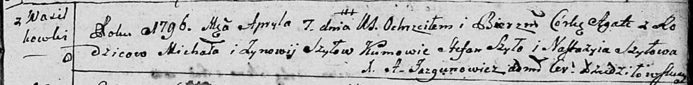

**Шило Зыновия (Szyłowa Zynowija, Zenovia)**

11 сентября 1794 г -- крещение сына Яна (НИАБ 136-13-894, лист 22об,
№38/1794-р (ориг)), (РГИА 823-2-18, лист 250об, №28/1794-р (коп)).

7 апреля 1796 г -- крещение дочери Агаты (НИАБ 136-13-894, лист 229,
№39/1796-р (ориг)).

23 октября 1799 г -- крещение дочери Барбары (НИАБ 1781-27-199, лист
129, №47/1799-р).

4 февраля 1802 г -- крещение сына Петра (НИАБ 937-4-32, лист 6,
№2/1802-р).

4 сентября 1804 г -- крещение сына Винцентия (НИАБ 937-4-32, лист 10об,
№20/1804-р).

20 сентября 1812 г -- крещение сына Матея (НИАБ 937-4-32, лист 25об,
№23/1812-р).

**НИАБ 136-13-894:** Лист 22об. **Метрическая запись №38/1794-р
(ориг).**

{width="6.496527777777778in"
height="0.9071937882764655in"}

Дедиловичская Покровская церковь. 11 сентября 1794 года. Метрическая
запись о крещении.

Szyło Jan -- сын родителей с деревни Васильковка.

Szyło Michaś -- отец.

Szyłowa Zynowija -- мать.

Szyło Stefan - кум.

Szyłowa Nastazyia - кума.

Jazgunowicz Antoni -- ксёндз.

**РГИА 823-2-18:** Лист 250об. **Метрическая запись №28/1794-р (коп).**

{width="6.496527777777778in"
height="1.2770833333333333in"}

Дедиловичская Покровская церковь. \[11\] сентября 1794 года. Метрическая
запись о крещении.

Szyło Jan -- сын родителей с деревни Васильковка.

Szyło Michał -- отец.

Szyłowa Zynowija -- мать.

Szyło Stefan -- кум.

Szyłowa Nastazya -- кума.

Jazgunowicz Antoni -- ксёндз.

**НИАБ 136-13-894:** Лист 29. **Метрическая запись №39/1796-р (ориг).**

{width="6.496527777777778in"
height="0.8039359142607174in"}

Дедиловичская Покровская церковь. 7 апреля 1796 года. Метрическая запись
о крещении.

Szyłowna Agata -- дочь родителей с деревни Васильковка.

Szyło Michał -- отец.

Szyłowa Zynowija -- мать.

Szyło Stefan - кум.

Szyłowa Nastazyia - кума.

Jazgunowicz Antoni -- ксёндз.

**НИАБ 1781-27-199:** Лист 129. **Метрическая запись №47/1799-р.**

{width="6.496527777777778in"
height="0.49722222222222223in"}

Дедиловичский костел Наисвятейшего Сердца Иисуса. 23 октября 1799 года.
Метрическая запись о крещении.

Szyłowna Barbara -- дочь крестьян с деревни Васильковка.

Szyło Michaelis -- отец.

Szyłowa Zenovia -- мать.

Szyło Stephanus -- крестный отец.

Szyłowa Nasta -- крестная мать.

Linhart Hyacinthus -- ксёндз.

**НИАБ 937-4-32:** Лист 6. **Метрическая запись №2/1802-р.**

{width="6.496527777777778in"
height="1.0326388888888889in"}

Дедиловичский костел Наисвятейшего Сердца Иисуса. 4 февраля 1802 года.
Метрическая запись о крещении.

Szyło Petrus -- сын крестьян с деревни Васильковка.

Szyło Michael -- отец.

Szyłowa Zenowia -- мать.

Szyło Stefan -- крестный отец, с деревни Васильковка.

Szyłłowa Anastasia -- крестная мать, с деревни Васильковка.

Linhart Hyacinthus -- ксёндз.

**НИАБ 937-4-32:** Лист 10об. **Метрическая запись №20/1804-р.**

{width="6.496527777777778in"
height="0.8340277777777778in"}

Дедиловичский костел Наисвятейшего Сердца Иисуса. 4 сентября 1804 года.
Метрическая запись о крещении.

Szyło Vincenti -- сын крестьян с деревни Васильковка.

Szyło Michael -- отец.

Szyłowa Zienowia -- мать.

Szyło Benedict -- крестный отец.

Szyłowa -- крестная мать, с деревни Васильковка.

Galinowski Joann -- ксёндз, комендант Дедиловичского костела.

**НИАБ 937-4-32:** Лист 25об. **Метрическая запись №23/1812-р.**

{width="6.496527777777778in"
height="1.1902777777777778in"}

Дедиловичский костел Наисвятейшего Сердца Иисуса. 20 сентября 1812 года.
Метрическая запись о крещении.

Szyło Mathei -- сын крестьян с деревни Васильковка.

Szyło Michael -- отец.

Szyłowa Zenia -- мать.

Szyło Joann -- крестный отец.

Szyłowa Anastasia -- крестная мать, с деревни Васильковка.

Zychowski Gabriel -- ксёндз.
