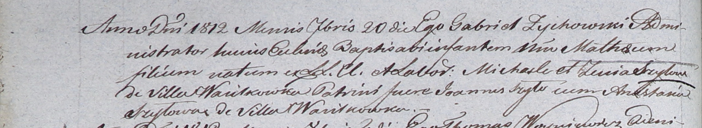

**Шило Матей Михасёв (Szyło Mathei)**

20 сентября 1812 г -- крещение (НИАБ 937-4-32, лист 25об, №23/1812-р).

**НИАБ 937-4-32:** Лист 25об. **Метрическая запись №23/1812-р.**

{width="6.496527777777778in"
height="1.1902777777777778in"}

Дедиловичский костел Наисвятейшего Сердца Иисуса. 20 сентября 1812 года.
Метрическая запись о крещении.

Szyło Mathei -- сын крестьян с деревни Васильковка.

Szyło Michael -- отец.

Szyłowa Zenia -- мать.

Szyło Joann -- крестный отец.

Szyłowa Anastasia -- крестная мать, с деревни Васильковка.

Zychowski Gabriel -- ксёндз.
