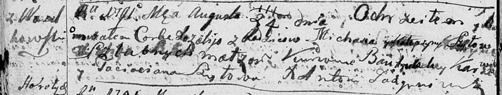

**Шило Катерина (Szyłowa Katerzyna)**

24 августа 1791 г -- крещение дочери Розалии (НИАБ 136-13-894, лист
13об, №40/1791-р (ориг)).

**НИАБ 136-13-894:** Лист 13об. **Метрическая запись №40/1791-р
(ориг).**

{width="6.496527777777778in"
height="1.236411854768154in"}

Дедиловичская Покровская церковь. 24 августа 1791 года. Метрическая
запись о крещении.

Szyłowna Rozalia -- дочь родителей с деревни Васильковка.

Szyło Michaś -- отец.

Szyłowa Katerzyna -- мать.

Karżewicz Bautrulek - кум.

Szyłowa Taciana - кума.

Jazgunowicz Antoni -- ксёндз.
