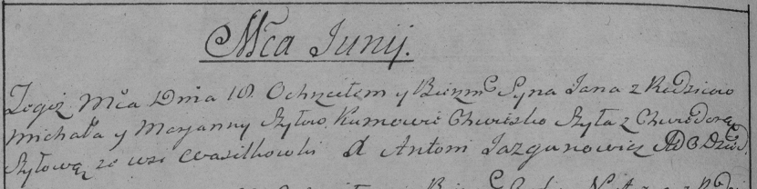

**Шило Ян Михасёв (Szyło Jan)**

18 июня 1788 г -- крещение (НИАБ 136-13-894, лист 4об, №33/1788-р
(ориг)), (РГИА 823-2-18, лист 236об, №17/1788-р (коп)).

**НИАБ 136-13-894:** Лист 4-об. **Метрическая запись №33/1788-р
(ориг).**

{width="6.496527777777778in"
height="1.0674442257217849in"}

Дедиловичская Покровская церковь. 18 июня 1788 года. Метрическая запись
о крещении.

Szyło Jan -- сын родителей с деревни Васильковка.

Szyło Michaś-- отец.

Shyłowa Marjana -- мать.

Szyło Chwiedor - кум.

Szyłowa Chwiedora - кума.

Jazgunowicz Antoni -- ксёндз.

**РГИА 823-2-18:** Лист 236об. **Метрическая запись №17/1788-р (коп).**

{width="6.496527777777778in"
height="1.6277777777777778in"}

Дедиловичская Покровская церковь. 18 июня 1788 года. Метрическая запись
о крещении.

Szyło Jan -- сын родителей с деревни Васильковка.

Szyło Michał -- отец.

Szyłowa Marjanna -- мать.

Szyło Chwieszko -- кум.

Szyłowa Chwiedora - кума.

Jazgunowicz Antoni -- ксёндз.
