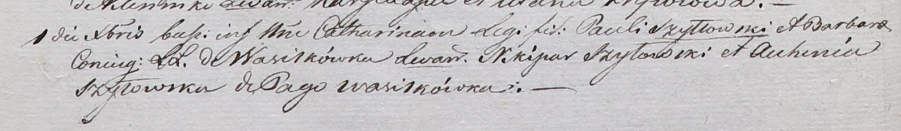

**Шило Никипор (Szyło, Szyłłowski Nikipor, Nikipar)**

11 января 1797 года -- свидетель венчания Тодора Шило с деревни Шилы с
девкой Анной Новик с деревни Шилы (НИАБ 136-13-920, лист 4, №1/1797-б
(ориг)).

17 января 1798 года -- венчание с Марьяной Гапанович с деревни Отруб
(НИАБ 136-13-920, лист 5, №1/1798-б (ориг)).

1 декабря 1801 г -- крестный отец Катарины, дочери Павла и Барбары Шил с
деревни Шилы (НИАБ 937-4-32, лист 4об, №26/1801-р).

24 января 1809 г -- свидетель венчания Василя Курнеша с деревни Лустичи
с девкой Натальей Ксёнжник с деревни Васильковка (НИАБ 136-13-920, лист
14об, №2/1809-б (ориг)).

**НИАБ 136-13-920:** Лист 4. **Метрическая запись №1/1797-б (ориг).**

{width="6.496527777777778in"
height="1.7151531058617673in"}

Дедиловичская Покровская церковь. 11 января 1797 года. Метрическая
запись о венчании.

Szyło Teodor -- жених, с деревни Шилы.

Nowikowna Anna -- невеста, девка, с деревни Шилы.

Szyło Jan -- свидетель.

Szyło Nikipor -- свидетель, деревня Васильковка.

Jazgunowicz Antoni -- ксёндз.

**НИАБ 136-13-920:** Лист 5. **Метрическая запись №1/1798-б (ориг).**

{width="6.496527777777778in"
height="1.6494433508311461in"}

Дедиловичская Покровская церковь. 17 января 1798 года. Метрическая
запись о венчании.

Szyło Nikiper -- жених, с деревни Васильковка.

Hapanowiczowa Marjana -- невеста, с деревни Отруб.

Szyło Janka -- свидетель, с деревни Васильковка.

Opanowicz Marcin -- свидетель.

Jazgunowicz Antoni -- ксёндз.

**НИАБ 937-4-32:** Лист 4об. **Метрическая запись №26/1801-р.**

{width="6.496527777777778in"
height="0.9493055555555555in"}

Дедиловичский костел Наисвятейшего Сердца Иисуса. 1 декабря 1801 года.
Метрическая запись о крещении.

Szyłłowska Catharina -- дочь родителей с деревни Васильковка.

Szyłłowski Paul -- отец.

Szyłłowska Barbara -- мать.

Szyłowski Nikipar -- крестный отец, с деревни Васильковка.

Szyłowska Auchinia -- крестная мать, с деревни Васильковка.

Linhart Hyacinthus -- ксёндз.

**НИАБ 136-13-920:** Лист 14об. **Метрическая запись №2/1809-б (ориг).**

{width="6.496527777777778in"
height="1.8961898512685915in"}

Дедиловичская Покровская церковь. 24 января 1809 года. Метрическая
запись о венчании.

Kurnesz Wasil -- жених, с деревни Лустичи.

Xięznikowa Natalla -- невеста, девка, с деревни Васильковка.

Brytka Chwiedor -- свидетель, с деревни Лустичи.

Szyło Nikiper -- свидетель, с деревни Васильковка.

Jazgunowicz Antoni -- ксёндз.
