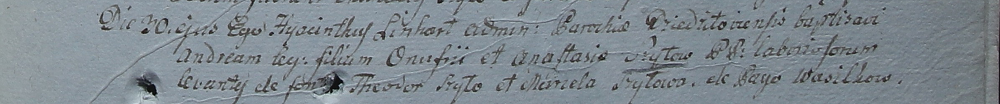

**Шило Андрей Онуфриев (Szyło Andreas)**

30 декабря 1799 г -- крещение (НИАБ 1781-27-199, лист 129, №52/1799-р).

**НИАБ 1781-27-199:** Лист 129. **Метрическая запись №52/1799-р.**

Дедиловичский костел Наисвятейшего Сердца Иисуса. 30 декабря 1799 года.
Метрическая запись о крещении.

Szyło Andreas -- дочь крестьян с деревни Васильковка.

Szyło Onufri -- отец.

Szyłowa Anastasia -- мать.

Szyło Theodor -- крестный отец.

Szyłowa Marcela -- крестная мать.

Linhart Hyacinthus -- ксёндз.
