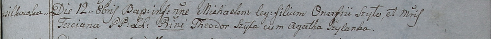

**Шило Михал Онуфриев (Szyło Michael)**

12 октября 1798 г -- крещение (НИАБ 1781-27-199, лист 123, №10/1798-р).

**НИАБ 1781-27-199:** Лист 123. **Метрическая запись №10/1798-р.**

{width="6.496527777777778in"
height="0.5236111111111111in"}

Дедиловичский костел Наисвятейшего Сердца Иисуса. 12 октября 1798 года.
Метрическая запись о крещении.

Szyło Michael -- сын крестьян с деревни Васильковка.

Szyło Onufri -- отец.

Szyłowa Taciana -- мать.

Szyło Theodor -- крестный отец.

Szyłanka Agatha - крестная мать.

Linhart Hyacinthus -- ксёндз.
