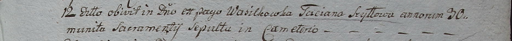

**Шило Татьяна (Szyłowa Taciana)**

12 октября 1798 г -- крещение сына Михала (НИАБ 1781-27-199, лист 123,
№10/1798-р).

12 января 1799 г -- отпевание, умерла в возрасте 30 лет (родилась около
1769 г) (НИАБ 1781-27-199, лист 127, №2/1799-у).

**НИАБ 1781-27-199:** Лист 123. **Метрическая запись №10/1798-р.**

{width="6.496527777777778in"
height="0.5236111111111111in"}

Дедиловичский костел Наисвятейшего Сердца Иисуса. 12 октября 1798 года.
Метрическая запись о крещении.

Szyło Michael -- сын крестьян с деревни Васильковка.

Szyło Onufri -- отец.

Szyłowa Taciana -- мать.

Szyło Theodor -- крестный отец.

Szyłanka Agatha - крестная мать.

Linhart Hyacinthus -- ксёндз.

**НИАБ 1781-27-199:** Лист 127. **Метрическая запись №2/1799-у.**

{width="6.496527777777778in"
height="0.53125in"}

Дедиловичский костел Наисвятейшего Сердца Иисуса. 12 января 1799 года.
Метрическая запись об отпевании.

Szyłłowa Taciana -- умершая, 30 лет, с деревни Васильковка.

Linhart Hyacinthus -- ксёндз.
