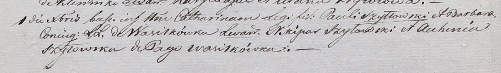

**Шило Барбара (Szyłłowska Barbara)**

1 декабря 1801 г -- крещение дочери Катарины (НИАБ 937-4-32, лист 4об,
№26/1801-р).

**НИАБ 937-4-32:** Лист 4об. **Метрическая запись №26/1801-р.**

Дедиловичский костел Наисвятейшего Сердца Иисуса. 1 декабря 1801 года.
Метрическая запись о крещении.

Szyłłowska Catharina -- дочь родителей с деревни Васильковка.

Szyłłowski Paul -- отец.

Szyłłowska Barbara -- мать.

Szyłowski Nikipar -- крестный отец, с деревни Васильковка.

Szyłowska Auchinia -- крестная мать, с деревни Васильковка.

Linhart Hyacinthus -- ксёндз.
