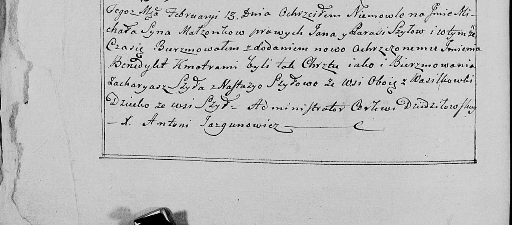

**Шило (Церах) Настасья (Szyłowa Nastazya z Cierachow)**

3 февраля 1789 г -- венчание с Павлом Шило (НИАБ 136-13-894, лист
67обоб, №4/1789-б (ориг)).

13 февраля 1799 года -- крестная мать Михала Бенедыкта, сына Шил Яна и
Параси с деревни Шилы (НИАБ 136-13-938, лист 240об, №9/1799-б (коп)).

**НИАБ 136-13-894:** Лист 67об. **Метрическая запись №4/1789-б (ориг).**

{width="6.496527777777778in"
height="0.773092738407699in"}

Дедиловичская Покровская церковь. 3 февраля 1789 года. Метрическая
запись о венчании.

Szyło Paweł -- жених, с деревни Васильковка.

Cierachowna Nastazya -- невеста.

Szyło Tomasz -- свидетель.

Szyło Antoś -- свидетель.

Borzdyka Michał -- свидетель.

Jazgunowicz Antoni -- ксёндз.

**НИАБ 136-13-938:** Лист 240об. **Метрическая запись №9/1799-р (коп).**

(См. тж. НИАБ 136-13-894, лист 38, №9/1799-р (ориг); РГИА 823-2-18, лист
268об, №9/1799-р (коп))

{width="6.496527777777778in"
height="2.8625in"}

Дедиловичская Покровская церковь. 13 февраля 1799 года. Метрическая
запись о крещении.

Szyło Michał Benedykt -- сын родителей с деревни Шилы.

Szyło Jan -- отец.

Szyłowa Parasia -- мать.

Szyło Zacharyasz -- кум, с деревни Васильковка.

Szyłowa Nastazya - кума, с деревни Васильковка.

Jazgunowicz Antoni -- ксёндз.
