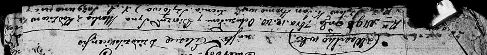

**Шило Марко Павлов (Szyło Marko)**

12 сентября 1798 г -- крещение (НИАБ 136-13-894, лист 36об, №41/1798-р
(ориг)), (РГИА 823-2-18, лист 266, №42/1798-р (коп)).

**НИАБ 136-13-894:** Лист 36об. **Метрическая запись №41/1798-р
(ориг).**

Дедиловичская Покровская церковь. 12 сентября 1798 года. Метрическая
запись о крещении.

Szyło Marko -- сын родителей с деревни Васильковка.

Szyło -- отец.

Szyłowa Róża -- мать.

Hromowicz Jan - кум.

Szyłowa Xienia - кума.

Jazgunowicz Antoni -- ксёндз.

**РГИА 823-2-18:** Лист 266. **Метрическая запись №42/1798-р (коп).**

Дедиловичская Покровская церковь. 12 сентября 1798 года. Метрическая
запись о крещении.

Szyło Marko -- сын родителей с деревни Васильковка.

Szyło Paweł -- отец.

Szyłowa Róza -- мать.

Hromowicz Jan -- кум.

Szyłowa Xienia -- кума.

Jazgunowicz Antoni -- ксёндз.
