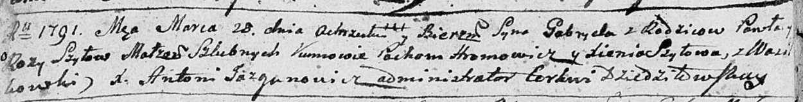
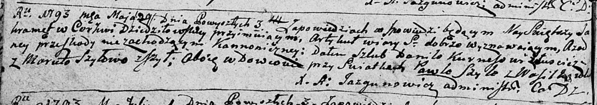

**Шило Павел (Szyło Paweł)**

28 марта 1791 г -- крещение сына Гавриила (НИАБ 136-13-894, лист 12об,
№11/1791-р (ориг)).

29 мая 1793 г -- вероятно, свидетель венчания Данилы Курнеша с деревни
Лустичи и Маруты Шило с деревни Шилы (НИАБ 136-13-894, лист 71об,
№3/1793-б (ориг)).

12 сентября 1798 г -- крещение сына Марка (НИАБ 136-13-894, лист 36об,
№41/1798-р (ориг)), (РГИА 823-2-18, лист 266, №42/1798-р (коп)).

27 октября 1801 г -- крещение сына Томаша (НИАБ 937-4-32, лист 4об,
№22/1801-р).

**НИАБ 136-13-894:** Лист 12об. **Метрическая запись №11/1791-р
(ориг).**

Дедиловичская Покровская церковь. 28 марта 1791 года. Метрическая запись
о крещении.

Szyło Gabriel -- сын родителей с деревни Васильковка.

Szyło Paweł -- отец.

Szyłowa Roza -- мать.

Hromowicz Pochom - кум.

Szyłowa Xienia - кума.

Jazgunowicz Antoni -- ксёндз.

**НИАБ 136-13-894:** Лист 71об. **Метрическая запись №3/1793-б (ориг).**

Дедиловичская Покровская церковь. 29 мая 1793 года. Метрическая запись о
венчании.

Kurnesz Daniło -- жених, вдовец, с деревни Лустичи.

Szyłowa Maruta -- невеста, вдова, с деревни Шилы.

Szyło Paweł -- свидетель, с деревни Васильковка.

Jazgunowicz Antoni -- ксёндз.

**НИАБ 136-13-894:** Лист 36об. **Метрическая запись №41/1798-р
(ориг).**

Дедиловичская Покровская церковь. 12 сентября 1798 года. Метрическая
запись о крещении.

Szyło Marko -- сын родителей с деревни Васильковка.

Szyło -- отец.

Szyłowa Róża -- мать.

Hromowicz Jan - кум.

Szyłowa Xienia - кума.

Jazgunowicz Antoni -- ксёндз.

**РГИА 823-2-18:** Лист 266. **Метрическая запись №42/1798-р (коп).**

Дедиловичская Покровская церковь. 12 сентября 1798 года. Метрическая
запись о крещении.

Szyło Marko -- сын родителей с деревни Васильковка.

Szyło Paweł -- отец.

Szyłowa Róza -- мать.

Hromowicz Jan -- кум.

Szyłowa Xienia -- кума.

Jazgunowicz Antoni -- ксёндз.

**НИАБ 937-4-32:** Лист 4об. **Метрическая запись №22/1801-р.**

Дедиловичский костел Наисвятейшего Сердца Иисуса. 27 октября 1801 года.
Метрическая запись о крещении.

Szyło Thomasz -- сын родителей с деревни Васильковка.

Szyło Paul -- отец.

Szyłowa Rosa -- мать.

Hramowicz Joann -- крестный отец, с деревни Васильковка.

Szyłanka Anna -- крестная мать, с деревни Васильковка.

Linhart Hyacinthus -- ксёндз.
