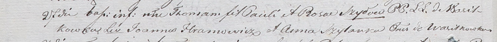

**Шило Томаш Павлов (Szyło Tomasz)**

27 октября 1801 г -- крещение (НИАБ 937-4-32, лист 4об, №22/1801-р).

**НИАБ 937-4-32:** Лист 4об. **Метрическая запись №22/1801-р.**

Дедиловичский костел Наисвятейшего Сердца Иисуса. 27 октября 1801 года.
Метрическая запись о крещении.

Szyło Thomasz -- сын родителей с деревни Васильковка.

Szyło Paul -- отец.

Szyłowa Rosa -- мать.

Hramowicz Joann -- крестный отец, с деревни Васильковка.

Szyłanka Anna -- крестная мать, с деревни Васильковка.

Linhart Hyacinthus -- ксёндз.
