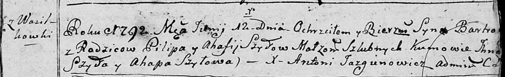
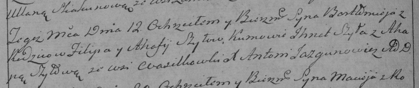

**Шило Балтромей Пилипов (Szyło Bartromiey)**

12 июня 1792 г -- крещение (НИАБ 136-13-894, лист 16, №33/1792-р
(ориг)), (РГИА 823-2-18, лист 244, №14/1792-р (коп)).

**НИАБ 136-13-894:** Лист 16. **Метрическая запись №33/1792-р (ориг).**

Дедиловичская Покровская церковь. 12 июня 1792 года. Метрическая запись
о крещении.

Szyło Bartromiey -- сын родителей с деревни Васильковка.

Szyło Pilip -- отец.

Szyłowa Ahafija -- мать.

Szyło Jhnat - кум.

Szyłowa Ahapa - кума.

Jazgunowicz Antoni -- ксёндз.

**РГИА 823-2-18:** Лист 244об. **Метрическая запись №14/1792-р (коп).**

Дедиловичская Покровская церковь. 12 июня 1792 года. Метрическая запись
о крещении.

Szyło Bałtromiey -- сын родителей с деревни Васильковка.

Szyło Filip -- отец.

Szyłowa Ahafija -- мать.

Szyła Jhnat -- кум.

Szyłowa Ahapa -- кума.

Jazgunowicz Antoni -- ксёндз.
