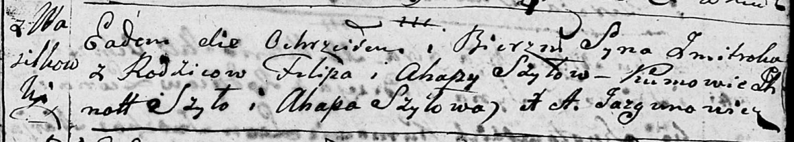
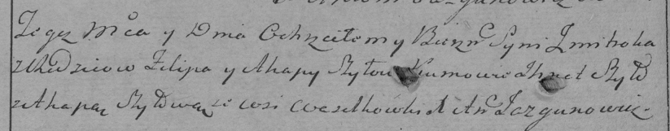

**Шило Змицер Пилипов (Szyło Zmitrok)**

28 октября 1795 г -- крещение (НИАБ 136-13-894, лист 26, №48/1795-р
(ориг)), (РГИА 823-2-18, лист 253об, №36/1795-р (коп)).

Лист 26. **Метрическая запись №48/1795-р (ориг).**

Дедиловичская Покровская церковь. 28 октября 1795 года. Метрическая
запись о крещении.

Szyło Zmitrok -- сын родителей с деревни Васильковка.

Szyło Filip -- отец.

Szyłowa Ahapa -- мать.

Szyło Jhnat - кум.

Szyłowa Ahapa - кума.

Jazgunowicz Antoni -- ксёндз.

**РГИА 823-2-18:** Лист 253об. **Метрическая запись №36/1795-р (коп).**

Дедиловичская Покровская церковь. 29 октября 1795 года. Метрическая
запись о крещении.

Szyło Zmitrok -- сын родителей с деревни Васильковка.

Szyło Filip -- отец.

Szyłowa Ahapa -- мать.

Szyło Jhnat -- кум.

Szyłowa Ahapa -- кума.

Jazgunowicz Antoni -- ксёндз.
