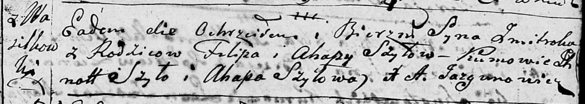

**Шило Пилип (Szyło Pilip)**

12 июня 1792 г -- крещение сына Балтромей (НИАБ 136-13-894, лист 16,
№33/1792-р (ориг)), (РГИА 823-2-18, лист 244, №14/1792-р (коп)).

28 октября 1795 г -- крещение сына Змицера (НИАБ 136-13-894, лист 26,
№48/1795-р (ориг)), (РГИА 823-2-18, лист 253об, №36/1795-р (коп)).

**НИАБ 136-13-894:** Лист 16. **Метрическая запись №33/1792-р (ориг).**

{width="6.496527777777778in"
height="1.0017355643044619in"}

Дедиловичская Покровская церковь. 12 июня 1792 года. Метрическая запись
о крещении.

Szyło Bartromiey -- сын родителей с деревни Васильковка.

Szyło Pilip -- отец.

Szyłowa Ahafija -- мать.

Szyło Jhnat - кум.

Szyłowa Ahapa - кума.

Jazgunowicz Antoni -- ксёндз.

**РГИА 823-2-18:** Лист 244об. **Метрическая запись №14/1792-р (коп).**

{width="6.496527777777778in"
height="1.3715277777777777in"}

Дедиловичская Покровская церковь. 12 июня 1792 года. Метрическая запись
о крещении.

Szyło Bałtromiey -- сын родителей с деревни Васильковка.

Szyło Filip -- отец.

Szyłowa Ahafija -- мать.

Szyła Jhnat -- кум.

Szyłowa Ahapa -- кума.

Jazgunowicz Antoni -- ксёндз.

Лист 26. **Метрическая запись №48/1795-р (ориг).**

{width="6.496527777777778in"
height="1.1660094050743657in"}

Дедиловичская Покровская церковь. 28 октября 1795 года. Метрическая
запись о крещении.

Szyło Zmitrok -- сын родителей с деревни Васильковка.

Szyło Filip -- отец.

Szyłowa Ahapa -- мать.

Szyło Jhnat - кум.

Szyłowa Ahapa - кума.

Jazgunowicz Antoni -- ксёндз.

**РГИА 823-2-18:** Лист 253об. **Метрическая запись №36/1795-р (коп).**

{width="6.496527777777778in"
height="1.2708333333333333in"}

Дедиловичская Покровская церковь. 29 октября 1795 года. Метрическая
запись о крещении.

Szyło Zmitrok -- сын родителей с деревни Васильковка.

Szyło Filip -- отец.

Szyłowa Ahapa -- мать.

Szyło Jhnat -- кум.

Szyłowa Ahapa -- кума.

Jazgunowicz Antoni -- ксёндз.
