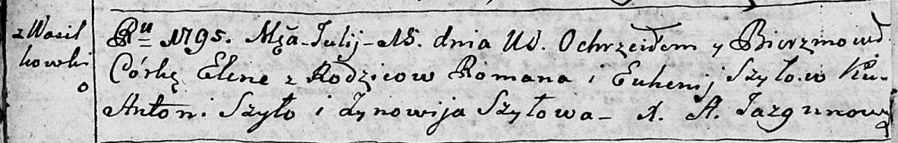
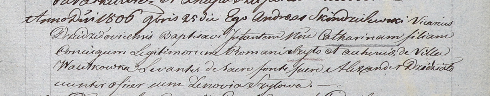

**Шило (Каржевич) Евгения (Szyłowa Euhenija z Karżewiczow)**

30 октября 1793 г -- венчание с Романом Шило с деревни Васильковка (НИАБ
136-13-894, лист 72, №21/1793-б (ориг)).

15 июля 1795 г -- крещение дочери Елены (НИАБ 136-13-894, лист 24об,
№21/1795-р (ориг)).

15 марта 1803 г -- крестная мать Игнатия, сына Адама и Агапы Шил с
деревни Васильковка (НИАБ 937-4-32, лист 9, №8/1803-р).

25 ноября 1806 г -- крещение дочери Катарины (НИАБ 937-4-32, лист 14,
№24/1806-р).

**НИАБ 136-13-894:** Лист 72. **Метрическая запись №6/1793-б (ориг).**

Дедиловичская Покровская церковь. 30 октября 1793 года. Метрическая
запись о венчании.

Szyło Roman -- жених, с деревни Васильковка.

Karżewiczowna Euhenija -- невеста.

Szyło Adam -- свидетель, с деревни Васильковка.

Szyło Jaśka -- свидетель, с деревни Шилы.

Szyło Wasil -- свидетель.

Jazgunowicz Antoni -- ксёндз.

**НИАБ 136-13-894:** Лист 24-об. **Метрическая запись №21/1795-р
(ориг).**

Дедиловичская Покровская церковь. 15 июля 1795 года. Метрическая запись
о крещении.

Szyłowna Elena-- дочь родителей с деревни Васильковка.

Szyło Roman -- отец.

Szyłowa Euhenija -- мать.

Szyło Antoni - кум.

Szyłowa Zynowija - кума.

Jazgunowicz Antoni -- ксёндз.

**НИАБ 937-4-32:** Лист 9. **Метрическая запись №8/1803-р.**

Дедиловичский костел Наисвятейшего Сердца Иисуса. 15 марта 1803 года.
Метрическая запись о крещении.

Szyło Jgnati -- сын родителей с деревни Васильковка.

Szyło Adam -- отец.

Szyłowa Ahapa -- мать.

Bielawski Gabriel -- крестный отец.

Szyłowa Eugenia -- крестная мать, с деревни Васильковка.

Kłoczko Antoni -- ксёндз, администратор церкви Омнишевской.

**НИАБ 937-4-32:** Лист 14. **Метрическая запись №24/1806-р.**

Дедиловичский костел Наисвятейшего Сердца Иисуса. 25 ноября 1806 года.
Метрическая запись о крещении.

Szyłowna Catharina -- дочь родителей с деревни Васильковка.

Szyło Roman -- отец.

Szyłowa Euhenia -- мать.

Dziedziało Alexander -- крестный отец, унтерофицер.

Szyłowa Zenovia -- крестная мать.

Skindzelewski Andreas -- ксёндз, викарий Дедиловичский.
