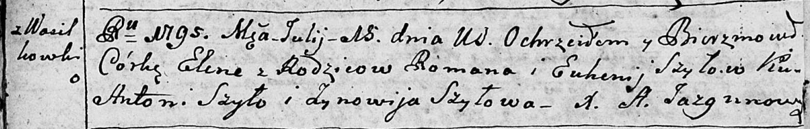

**Шило Елена Романова (Szyłowna Elena)**

15 июля 1795 г -- крещение (НИАБ 136-13-894, лист 24об, №21/1795-р
(ориг)).

**НИАБ 136-13-894:** Лист 24-об. **Метрическая запись №21/1795-р
(ориг).**

{width="6.496527777777778in"
height="1.0433070866141732in"}

Дедиловичская Покровская церковь. 15 июля 1795 года. Метрическая запись
о крещении.

Szyłowna Elena-- дочь родителей с деревни Васильковка.

Szyło Roman -- отец.

Szyłowa Euhenija -- мать.

Szyło Antoni - кум.

Szyłowa Zynowija - кума.

Jazgunowicz Antoni -- ксёндз.
