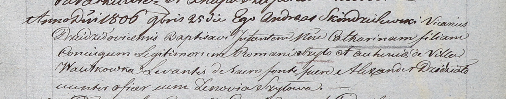

**Шило Катарина Романова (Szyłowna Catharina)**

25 ноября 1806 г -- крещение (НИАБ 937-4-32, лист 14, №24/1806-р).

**НИАБ 937-4-32:** Лист 14. **Метрическая запись №24/1806-р.**

Дедиловичский костел Наисвятейшего Сердца Иисуса. 25 ноября 1806 года.
Метрическая запись о крещении.

Szyłowna Catharina -- дочь родителей с деревни Васильковка.

Szyło Roman -- отец.

Szyłowa Euhenia -- мать.

Dziedziało Alexander -- крестный отец, унтерофицер.

Szyłowa Zenovia -- крестная мать.

Skindzelewski Andreas -- ксёндз, викарий Дедиловичский.
