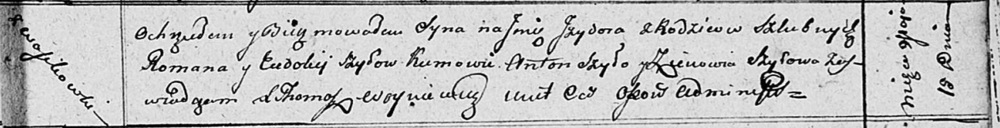

**Шило Евдокия (Szyłowa Ewdokija)**

18 мая 1811 г -- крещение сына Изыдора (НИАБ 136-13-894, лист 81,
№24/1811-р (ориг)).

**НИАБ 136-13-894:** Лист 81. **Метрическая запись №24/1811-р (ориг).**

{width="6.496527777777778in"
height="0.8327679352580928in"}

Осовская Покровская церковь. 18 мая 1811 года. Метрическая запись о
крещении.

Szyło Jzydor -- сын родителей с деревни Васильковка.

Szyło Roman -- отец.

Szyłowa Ewdokija -- мать.

Szyło Anton-- кум.

Szyłowa Zienowia -- кума.

Woyniewicz Tomasz -- ксёндз.
