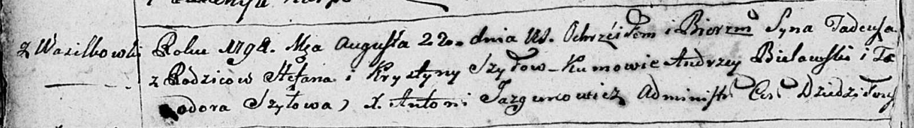
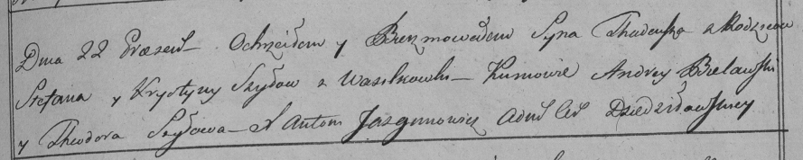
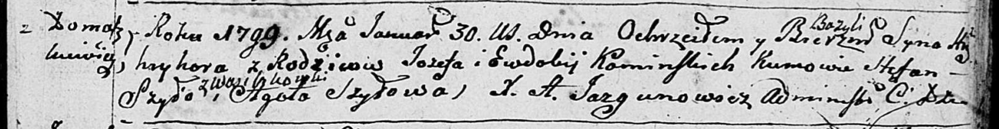
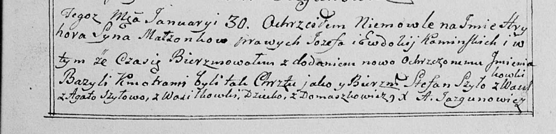
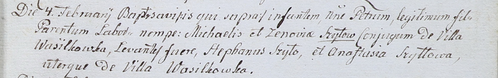
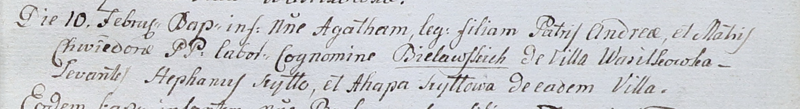

**Шило Степан (Szyło Stefan)**

22 августа 1798 г -- крещение сына Тадея (НИАБ 136-13-894, лист 36об,
№36/1798-р (ориг)), (РГИА 823-2-18, лист 265, №36/1798-р (коп)).

30 января 1799 г -- кум при крещении сына Тадея у Каминских Иосифа и
Евдокии с деревни Домашковичи (НИАБ 136-13-894, лист 38, №4/1799-р
(ориг), НИАБ 136-13-938, лист 240, №4/1799-р (коп)).

4 февраля 1802 г -- крестный отец Петра, сына Михася и Зыновии Шил с
деревни Васильковка (НИАБ 937-4-32, лист 6, №2/1802-р).

10 февраля 1802 г -- крестный отец Агаты, дочери Андрея и Хведоры
Белявских с деревни Васильковка (НИАБ 937-4-32, лист 6, №3/1802-р).

**НИАБ 136-13-894:** Лист 36об. **Метрическая запись №36/1798-р
(ориг).**

Дедиловичская Покровская церковь. 22 августа 1798 года. Метрическая
запись о крещении.

Szyło Tadeusz -- сын родителей с деревни Васильковка.

Szyło Stefan -- отец.

Szyłowa Krystyna -- мать.

Bielawski Andrzey - кум.

Szyłowa Teodora - кума.

Jazgunowicz Antoni -- ксёндз.

**РГИА 823-2-18:** Лист 265. **Метрическая запись №36/1798-р (коп).**

Дедиловичская Покровская церковь. 22 августа 1798 года. Метрическая
запись о крещении.

Szyło Thadeusz -- сын родителей с деревни Васильковка.

Szyło Stefan -- отец.

Szyłowa Krystyna -- мать.

Bielawski Andrzey -- кум.

Szyłowa Theodora -- кума.

Jazgunowicz Antoni -- ксёндз.

**НИАБ 136-13-894:** Лист 38. **Метрическая запись №4/1799-р (ориг).**

Дедиловичская Покровская церковь. 30 января 1799 года. Метрическая
запись о крещении.

Kaminski Hryhor Bazyli -- сын родителей с деревни Домашковичи.

Kaminski Jozef -- отец.

Kaminska Ewdokija -- мать.

Szyło Stefan -- кум с деревни Васильковка.

Szyłowa Agata -- кума.

Jazgunowicz Antoni -- ксёндз.

**НИАБ 136-13-938:** Лист 240. **Метрическая запись №4/1799-р (коп).**

(См. тж. НИАБ 136-13-894, лист 38, №4/1799-р (ориг); РГИА 823-2-18, лист
268, №4/1799-р (коп))

Дедиловичская Покровская церковь. 30 января 1799 года. Метрическая
запись о крещении.

Kaminski Hryhor Bazyli -- сын родителей с деревни Домашковичи.

Kaminski Jozef -- отец.

Kaminska Ewdokija -- мать.

Szyło Stefan -- кум, с деревни Васильковка.

Szyłowa Agata - кума, с деревни Васильковка.

Jazgunowicz Antoni -- ксёндз.

**НИАБ 937-4-32:** Лист 6. **Метрическая запись №2/1802-р.**

Дедиловичский костел Наисвятейшего Сердца Иисуса. 4 февраля 1802 года.
Метрическая запись о крещении.

Szyło Petrus -- сын крестьян с деревни Васильковка.

Szyło Michael -- отец.

Szyłowa Zenowia -- мать.

Szyło Stefan -- крестный отец, с деревни Васильковка.

Szyłłowa Anastasia -- крестная мать, с деревни Васильковка.

Linhart Hyacinthus -- ксёндз.

**НИАБ 937-4-32:** Лист 6. **Метрическая запись №3/1802-р.**

Дедиловичский костел Наисвятейшего Сердца Иисуса. 10 февраля 1802 года.
Метрическая запись о крещении.

Bielawska Agatha -- дочь крестьян с деревни Васильковка.

Bielawski Andreas -- отец.

Bielawska Chwiedora -- мать.

Szyłło Stefan -- крестный отец, с деревни Васильковка.

Szyłłowa Ahapa -- крестная мать, с деревни Васильковка.

Linhart Hyacinthus -- ксёндз.
