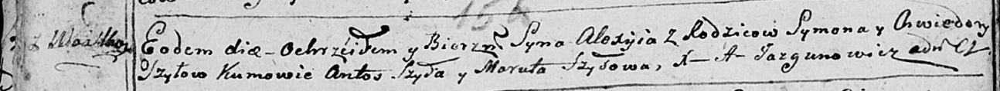

**Шило Алексей Сымонов (Szyło Alexyj)**

14 марта 1792 г -- крещение (НИАБ 136-13-894, лист 15об, №15/1792-р
(ориг)).

**НИАБ 136-13-894:** Лист 15об. **Метрическая запись №15/1792-р
(ориг).**

Дедиловичская Покровская церковь. 14 марта 1792 года. Метрическая запись
о крещении.

Szyło Alexyj -- сын родителей с деревни Васильковка.

Szyło Symon -- отец.

Szyłowa Chwiedora -- мать.

Szyło Antoś - кум.

Szyłowa Maruta - кума.

Jazgunowicz Antoni -- ксёндз.
