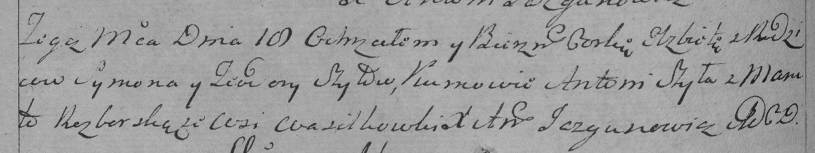

**Шило Елисавета Сымонова (Szyłowna Elżbieta)**

18 февраля 1795 г -- крещение (НИАБ 136-13-894, лист 23об, №3/1795-р
(ориг)), (РГИА 823-2-18, лист 251об, №3/1795-р (коп)).

**НИАБ 136-13-894:** Лист 23об. **Метрическая запись №3/1795-р (ориг).**

Дедиловичская Покровская церковь. 18 февраля 1795 года. Метрическая
запись о крещении.

Szyłowna Elżbieta -- дочь родителей с деревни Васильковка.

Szyło Symon -- отец.

Szyłowa Teodora -- мать.

Szyła Antoni - кум.

Rozborska Maruta - кума.

Jacuk Jan - ассистент.

Słabkowska Teresa - ассистентка.

Jazgunowicz Antoni -- ксёндз.

**РГИА 823-2-18:** Лист 251об. **Метрическая запись №3/1795-р (коп).**

Дедиловичская Покровская церковь. 18 февраля 1795 года. Метрическая
запись о крещении.

Szyłowna Elżbieta -- дочь родителей с деревни Васильковки.

Szyło Symon -- отец.

Szyłowa Teodora -- мать.

Szyła Antoni -- кум.

Razborska Maruta -- кума.

Jazgunowicz Antoni -- ксёндз.
