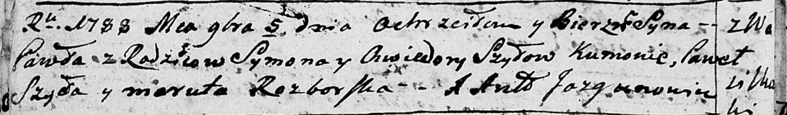

**Шило Павел Сымонов (Szyło Paweł)**

5 ноября 1788 г -- крещение (НИАБ 136-13-894, лист 5об, №61/1788-р
(ориг)).

**НИАБ 136-13-894:** Лист 5об. **Метрическая запись №61/1788-р (ориг).**

{width="6.496527777777778in"
height="0.9588232720909886in"}

Дедиловичская Покровская церковь. 5 ноября 1788 года. Метрическая запись
о крещении.

Szyło Paweł -- сын родителей с деревни Васильковка.

Szyło Symon-- отец.

Szyłowa Chwiedora -- мать.

Szyło Paweł - кум.

Rozborska Maruta - кума.

Jazgunowicz Antoni -- ксёндз.
