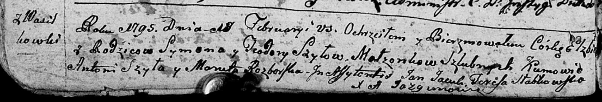

**Шило Федора (Szyłowa Chwiedora, Teodora)**

5 ноября 1788 г -- крещение сына Павла (НИАБ 136-13-894, лист 5об,
№61/1788-р (ориг)).

14 марта 1792 г -- крещение сына Алексея (НИАБ 136-13-894, лист 15об,
№15/1792-р (ориг)).

18 февраля 1795 г -- крещение дочери Елисаветы (НИАБ 136-13-894, лист
23об, №3/1795-р (ориг)), (РГИА 823-2-18, лист 251об, №3/1795-р (коп)).

3 марта 1801 г -- возможно, крестная мать у Анны Марты, дочери
Шапелевичей Хведора и Агафии с деревни Домашковичи (НИАБ 136-13-894,
лист 43, №8/1801-р (ориг)).

**НИАБ 136-13-894:** Лист 5об. **Метрическая запись №61/1788-р (ориг).**

{width="6.496527777777778in"
height="0.9588232720909886in"}

Дедиловичская Покровская церковь. 5 ноября 1788 года. Метрическая запись
о крещении.

Szyło Paweł -- сын родителей с деревни Васильковка.

Szyło Symon-- отец.

Szyłowa Chwiedora -- мать.

Szyło Paweł - кум.

Rozborska Maruta - кума.

Jazgunowicz Antoni -- ксёндз.

**НИАБ 136-13-894:** Лист 15об. **Метрическая запись №15/1792-р
(ориг).**

{width="6.496527777777778in"
height="0.5974201662292213in"}

Дедиловичская Покровская церковь. 14 марта 1792 года. Метрическая запись
о крещении.

Szyło Alexyj -- сын родителей с деревни Васильковка.

Szyło Symon -- отец.

Szyłowa Chwiedora -- мать.

Szyło Antoś - кум.

Szyłowa Maruta - кума.

Jazgunowicz Antoni -- ксёндз.

**НИАБ 136-13-894:** Лист 23об. **Метрическая запись №3/1795-р (ориг).**

{width="6.496527777777778in"
height="1.1103576115485565in"}

Дедиловичская Покровская церковь. 18 февраля 1795 года. Метрическая
запись о крещении.

Szyłowna Elżbieta -- дочь родителей с деревни Васильковка.

Szyło Symon -- отец.

Szyłowa Teodora -- мать.

Szyła Antoni - кум.

Rozborska Maruta - кума.

Jacuk Jan - ассистент.

Słabkowska Teresa - ассистентка.

Jazgunowicz Antoni -- ксёндз.

**РГИА 823-2-18:** Лист 251об. **Метрическая запись №3/1795-р (коп).**

{width="6.496527777777778in"
height="1.2194444444444446in"}

Дедиловичская Покровская церковь. 18 февраля 1795 года. Метрическая
запись о крещении.

Szyłowna Elżbieta -- дочь родителей с деревни Васильковки.

Szyło Symon -- отец.

Szyłowa Teodora -- мать.

Szyła Antoni -- кум.

Razborska Maruta -- кума.

Jazgunowicz Antoni -- ксёндз.

**НИАБ 136-13-894:** Лист 43. **Метрическая запись №8/1801-р (ориг).**

{width="6.496527777777778in"
height="1.7949431321084865in"}

Дедиловичская Покровская церковь. 3 марта 1801 года. Метрическая запись
о крещении.

Szapialewiczowa Anna Marta -- дочь родителей с деревни Домашковичи.

Szapialewicz Chwiedor -- отец.

Szapialewiczowa Ahapa -- мать.

Kurnesz Chwiedor -- кум, с деревни Лустичи.

Szyłowa Chwiedora -- кума, с деревни Васильковка.

Jazgunowicz Antoni -- ксёндз.
