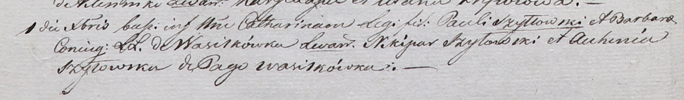

**Шило Авхиния (Szyłowa Agata)**

1 декабря 1801 г -- крестная мать Катарины, дочери Павла и Барбары Шил с
деревни Шилы (НИАБ 937-4-32, лист 4об, №26/1801-р).

28 ноября 1802 -- крестная мать Евы, дочери Павла и Барбары Шил с
деревни Замосточье (НИАБ 937-4-32, лист 8, №45/1802-р).

2 января 1805 г -- крестная мать Евы, дочери Адама и Агапы Шил с деревни
Васильковка (НИАБ 937-4-32, лист 11, №4/1805-р).

4 января 1806 г -- крестная мать Иоанна, сына Павла и Барбары Шил с
деревни Замосточье (НИАБ 937-4-32, лист 13, №1/1806-р).

**НИАБ 937-4-32:** Лист 4об. **Метрическая запись №26/1801-р.**

Дедиловичский костел Наисвятейшего Сердца Иисуса. 1 декабря 1801 года.
Метрическая запись о крещении.

Szyłłowska Catharina -- дочь родителей с деревни Васильковка.

Szyłłowski Paul -- отец.

Szyłłowska Barbara -- мать.

Szyłowski Nikipar -- крестный отец, с деревни Васильковка.

Szyłowska Auchinia -- крестная мать, с деревни Васильковка.

Linhart Hyacinthus -- ксёндз.

**НИАБ 937-4-32:** Лист 8. **Метрическая запись №45/1802-р.**

Дедиловичский костел Наисвятейшего Сердца Иисуса. 28 ноября 1802 года.
Метрическая запись о крещении.

Szyłowna Eva -- дочь крестьян с деревни Замосточье.

Szyło Paul -- отец.

Szyłowa Barbara -- мать.

Szyło Nikiper -- крестный отец.

Szyłowa Ahinia -- крестная мать, с деревни Васильковка.

Linhart Hyacinthus -- ксёндз.

**НИАБ 937-4-32:** Лист 11. **Метрическая запись №4/1805-р.**

Дедиловичский костел Наисвятейшего Сердца Иисуса. 2 января 1805 года.
Метрическая запись о крещении.

Szyłowna Eva -- дочь крестьян с деревни Васильковка.

Szyło Adam -- отец.

Szyłowa Ahapa -- мать.

Bielawski Haryło -- крестный отец, с деревни Васильковка.

Szyłowa Auchinia -- крестная мать, с деревни Васильковка.

Linhart Hiacinthus -- ксёндз.

**НИАБ 937-4-32:** Лист 13. **Метрическая запись №1/1806-р.**

Дедиловичский костел Наисвятейшего Сердца Иисуса. 4 января 1806 года.
Метрическая запись о крещении.

Szyło Jоann -- сын родителей с деревни Замосточье.

Szyło Paul -- отец.

Szyłowa Barbara -- мать.

Szyło Nikiper -- крестный отец.

Szyłowa Auhinia -- крестная мать, с деревни Васильковка.

Linhart Hiacinthus -- ксёндз.
