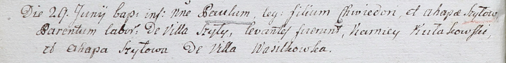

**Шило Агапа (Szyłowa Agapa)**

29 июня 1802 года -- крестная матьПавла, сына Хведора и Гапы с деревни
Шилы (НИАБ 937-4-32, лист 6об, №17/1802-р).

**НИАБ 937-4-32:** Лист 6об. **Метрическая запись №17/1802-р.**

Дедиловичский костел Наисвятейшего Сердца Иисуса. 29 июня 1802 года.
Метрическая запись о крещении.

Szyło Paul -- сын крестьян с деревни Шилы.

Szyło Chwiedor -- отец.

Szyłowa Ahapa -- мать.

Kułakowski Karniey -- крестный отец.

Szyłowa Ahapa -- крестная мать, с деревни Васильковка.

Linhart Hyacinthus -- ксёндз.
