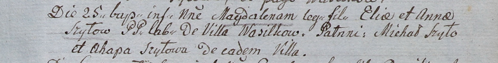

**Шило Агапа (Szyłowa Ahapa)**

25 июля 1805 г -- крестная мать Магдалены, дочери Ильи и Анны Шил с
деревни Васильковка (НИАБ 937-4-32, лист 12, №28/1805-р).

**НИАБ 937-4-32:** Лист 12. **Метрическая запись №28/1805-р.**

Дедиловичский костел Наисвятейшего Сердца Иисуса. 25 июля 1805 года.
Метрическая запись о крещении.

Szyłowna Magdalena -- дочь крестьян с деревни Васильковка.

Szyło Elia -- отец.

Szyłowa Anna -- мать.

Szyło Michał -- крестный отец.

Szyłowa Ahapa -- крестная мать, с деревни Васильковка.

Linhart Hiacinthus -- ксёндз.
