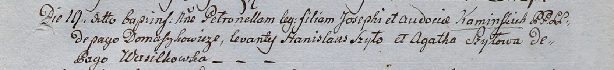

**Шило Агата (Szyłowa Agata)**

30 января 1799 г -- крестная мать Грыгора Базылия, сына Каминских Иосифа
и Евдокии с деревни Домашковичи (НИАБ 136-13-938, лист 240, №4/1799-р
(коп)).

19 мая 1800 г -- крестная мать Петронели, дочери Каминских Иосифа и
Евдокии с деревни Домашковичи (НИАБ 937-4-32, лист 2, №2/1800-р).

**НИАБ 136-13-938:** Лист 240. **Метрическая запись №4/1799-р (коп).**

(См. тж. НИАБ 136-13-894, лист 38, №4/1799-р (ориг); РГИА 823-2-18, лист
268, №4/1799-р (коп))

Дедиловичская Покровская церковь. 30 января 1799 года. Метрическая
запись о крещении.

Kaminski Hryhor Bazyli -- сын родителей с деревни Домашковичи.

Kaminski Jozef -- отец.

Kaminska Ewdokija -- мать.

Szyło Stefan -- кум, с деревни Васильковка.

Szyłowa Agata - кума, с деревни Васильковка.

Jazgunowicz Antoni -- ксёндз.

**НИАБ 937-4-32:** Лист 2. **Метрическая запись №15/1800-р.**

Дедиловичский костел Наисвятейшего Сердца Иисуса. 19 мая 1800 года.
Метрическая запись о крещении.

Kaminska Petronella -- дочь крестьян с деревни Домашковичи.

Kaminski Joseph -- отец.

Kaminska Audocia -- мать.

Szyło Stanisław -- крестный отец.

Szyłowa Agatha -- крестная мать, с деревни Васильковка.

Linhart Hyacinthus -- ксёндз.
