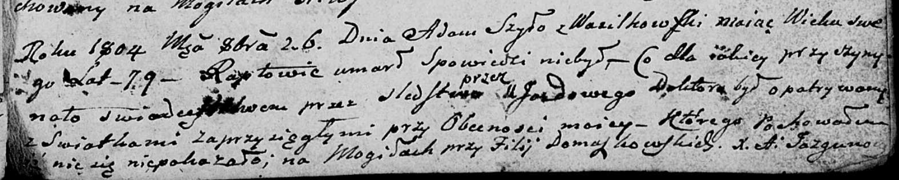

**Шило Зеновия (Szyłowa Zienovia)**

22 марта 1803 г -- крестная мать Иозефата, сына Михала и Марьяны Морозов
с деревни Васильковка (НИАБ 937-4-32, лист 9, №9/1803-р).

**НИАБ 937-4-32:** Лист 9. **Метрическая запись №9/1803-р.**

{width="6.496527777777778in"
height="1.0888888888888888in"}

Дедиловичский костел Наисвятейшего Сердца Иисуса. 22 марта 1803 года.
Метрическая запись о крещении.

Moroz Josephat -- сын крестьян с деревни Васильковка.

Moroz Michael -- отец.

Morozowa Marianna -- мать.

Szyło Basili -- крестный отец.

Szyłowa Zienowia -- крестная мать, с деревни Васильковка.

Galinowski Joann -- ксёндз, комендант Дедиловичского костела.
