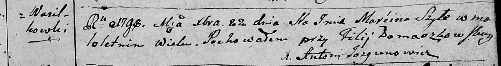

**Шило Мартин (Szyło Marcin)**

22 декабря 1798 г -- отпевание, умер в возрасте 20 лет (родился около
1778 г) (НИАБ 136-13-919, лист 8, №20/1798-у (ориг)).

**НИАБ 136-13-919:** Лист 8. **Метрическая запись №20/1798-у (ориг).**

{width="6.496527777777778in"
height="0.8673611111111111in"}

Дедиловичская Покровская церковь. 22 декабря 1798 года. Метрическая
запись об отпевании.

Szyło Marćin -- умерший, малолетний, с деревни Васильковка, похоронен на
кладбище при филии Домашковичской.

Jazgunowicz Antoni -- ксёндз.
