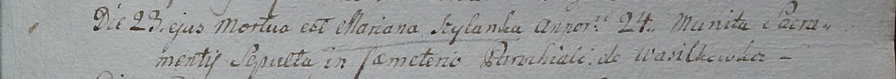

**Шило Марьяна (Szyłanka Mariana)**

23 октября 1799 г -- отпевание, умерла в возрасте 24 лет (родилась около
1775 г) (НИАБ 1781-27-199, лист 131, №21/1799-у).

**НИАБ 136-13-894:** Лист 131. **Метрическая запись №21/1799-у.**

Дедиловичский костел Наисвятейшего Сердца Иисуса. 23 октября 1799 года.
Метрическая запись об отпевании.

Szyłanka Mariana -- умершая, 24 года, с деревни Васильковка.

Linhart Hyacinthus -- ксёндз.
