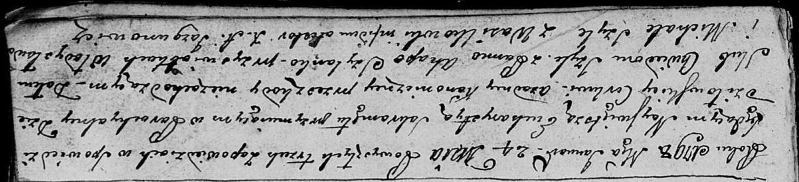

**Шило Михал (Szyło Michał)**

24 января 1798 г -- свидетель венчания Хведора Шилы и Агапы Шиланки
(НИАБ 136-13-920, лист 5, №3/1798-б (ориг)).

**НИАБ 136-13-920:** Лист 5. **Метрическая запись №3/1798-б (ориг).**

Дедиловичская Покровская церковь. 24 января 1798 года. Метрическая
запись о венчании.

Szyło Chwiedor -- жених.

Szyłanka Ahapa -- невеста.

Władysław -- свидетель.

Szyła Michał -- свидетель, с деревни Васильковка.

Jazgunowicz Antoni -- ксёндз.
